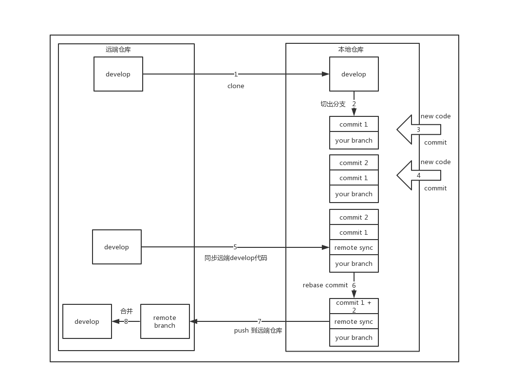
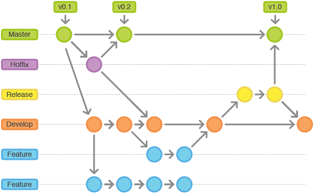

团队开发中，遵循一个合理、清晰的Git使用流程，是非常重要的。
否则，每个人都提交一堆杂乱无章的commit，项目很快就会变得难以协调和维护。

图1：分支提交流程



图2：分支合并流程




# 分支管理

## 命名及说明

|分支|命名|说明|
|-|-|-|
|主分支|master|发布分支|
|开发分支|develop|开发分支|
|功能分支|feature/xxx|新功能开发|
|修复分支|fix/xxx|开发过程缺陷修复|
|紧急修复分支|hotfix/xxx|生产环境缺陷修复|

### master

* master为主分支，是用于部署生产环境的分支。
* master分支节点由develop或hotfix分支合并而来，任何时间都不能直接修改其代码。
* 合并到master分支的代码，必须保证经过充分的测试。

### tag

* tag为master分支部署到生产环境后，在master分支节点上标注的一个标签。
* tag的命名规则：x.y.z，依次为主版本号，次版本号，bug修复号。

### develop

* develop为开发分支，始终保持最新完成的功能和bug修复后的代码。

### feature分支

* 开发新功能时，以develop为基准创建feature分支。
* 分支命名规则： feature/modules，modules为要新增的功能模块。

### fix分支
* 修复开发过程中发现的问题，以develop为基准创建fix分支。
* 分支命名规则：fix/problem，problem为要修复的问题。

### hotfix分支

* 当线上出现紧急问题时，需要及时修复，以master分支为基线，创建hotfix分支。问题修复完成并验证后，分别合并到master分支和develop分支。
* 分支命名规则：hotfix/problem ，problem为修复的问题。

## 提交代码

本地仓库完成分支功能的开发，即可撰写提交信息并提交commit至远端仓库。
提交PR的分支遵循最小功能或最少问题修复的原则，以减少问题复杂度和code review复杂度。

### feture、fix 分支提交

* 本地仓库分支rebase develop基线，并解决代码冲突。

```shell
(feature/xxx): git fetch origin
(feature/xxx): git rebase -i origin/develop
# 解决冲突
(feature/xxx): git commit
```

* 本地仓库rebase feature commit，合成一笔commit。

```shell
# 查看git log，feature/xxx 分支有3笔commit
(feature/xxx): git rebase -i HEAD~3
# 将3笔commit合成1笔
```

* push feture分支到远端仓库。

```shell
(feature/xxx): git push -u origin feature/xxx
```

### hotfix分支的提交

hotfix分支将问题修复并验证后，将本地仓库commit rebase为一笔后提交到远程仓库。

### 其他分支的提交

* 应对master分支加锁，不允许直接提交。在进行上线合并操作时，应由master以上权限的仓库管理员进行临时解锁操作分支。
* 应对develop分支加锁，不允许直接提交。在解决冲突等场景下，应由master以上权限的仓库管理员进行临时解锁操作分支。

### 撰写提交信息
提交commit时，必须给出完整扼要的提交信息，以下为范例：

```shell
简要信息(50字以内)
* 功能及改动原因(72字以内)
* 问题及注意事项(72字以内)

http://相关链接地址
```

## 合并代码

* 提交到远程仓库的分支，可在gitlab上新建pull request（提交PR时勾选删除原分支），由持续集成服务和人工code review确保代码质量后，相关人员对分支进行合并然后删除该分支。
* 若PR被打回，开发人员修改问题并重复提交代码的流程后，重复上一步骤。

```shell
#PR打回后重新提交到远端时可使用 --force 或 -f 参数覆盖远端分支
### ..... 
git push -f origin branchName
```

# 流程管理

## 冲突解决

* 如若遵循本规范，冲突会在本地仓库分支提交远端仓库前由开发人员自行解决。
* 当有多个PR合并到同一分支时，某个PR合并后导致另外一个或多个分支合并发生冲突，此时应由仓库master协同PR提交者解决冲突。

## PR提交修改

* 提交PR后，代码审核不通过，需要开发者修改重新提交。
* 操作者在PR合并前需要修改PR分支的代码并重新提交。

```shell
# 做一些修改
# 提交本地修改暂存
(feature/xxx): git add -A
# 提交至本地分支
(feature/xxx): git commit -a -m "message"
# 合并提交笔数
(feature/xxx): git rebase -i HEAD~n
# 推送至远端仓库分支
(feature/xxx): git push -f origin feature/xxx
```

完成以上步骤，远端仓库待合并PR分支就更新为更改后的代码，重新等待审核和合并即可。


## 已合并PR回滚

由于某些原因导致已经合并的PR需要回滚，由仓库master进行回滚操作。
开发者修改完问题后，重新提交PR进行合并。

## 发版流程

### 版本号

项目中版本控制通过以下部分组成：
|名称|说明|作用|
|-|-|-|
|versionMajor|主版本号|大版本更迭，不向下兼容|
|versionMinor|次版本号|小版本功能迭代|
|versionPatch|bug修复号|小版本问题修复|
|versionBuild|编译号|每次提测时增1|

* 生产环境通过 M.m.p 三个版本号来区分版本
* 用于测试时通过 M.m.p.b 四个版本号来区分版本

### 发布流程
当所有测试通过，代码（develop分支）达到交付水平时，由项目master来进行发版代码合并。
在进行发布流程前，应由仓库master同步更新远端仓库到本地仓库作为灾备。

* develop分支切出release分支。
* release分支更改版本号并提交。
* release分支合并至master分支。
* master分支推送至远端仓库。
* 在master分支上打上版本号（tag），推送至远端仓库。

## 紧急修复流程

上线发布后，若生产环境出现紧急缺陷需要修复，则走紧急发版流程

* 切至出现问题的版本（以1.2.0为例），切出分支 hotfix/1.2.1。
* 若由一人修复缺陷，则直接在hotfix/1.2.1分支上提交代码，待所有问题修复完毕且测试通过，将hotfix/1.2.1合并至master分支并打上tag推送至远端仓库。
* 若由多人修复缺陷，则每人分别从hotfix/1.2.1分支上切出分支提交代码，再合并至hotfix/1.2.1分支，待所有问题修复完毕且测试通过，将hotfix/1.2.1合并至master分支并打上tag推送至远端仓库。
* 将hotfix/1.2.1合并至develop分支，推送至远程。

## 多版本并存

一般项目开发过程中鲜有多个版本并行维护的案例，为应对这种场景我们有如下规范：

若项目在发布1.0版本后，需要并行1.0和2.0版本的开发

* 从master分支切出1.0分支，1.x - 2.0版本的开发就基于1.0为主分支进行开发，1.x分支除没有develop分支以外一切遵循之前的介绍的git规范流程。
* 2.x版本的开发继续遵循之前介绍的git规范流程。

并行开发时任一主分支上出现缺陷需要修复合并时，应追溯该问题产生的节点，若问题发生在主分支分叉之前，则修复合并时应合并至分叉后的每个主分支上，再合并至develop分支。


